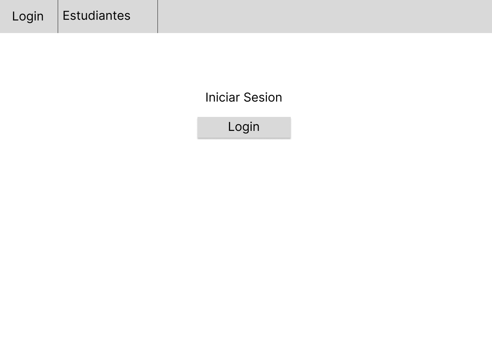
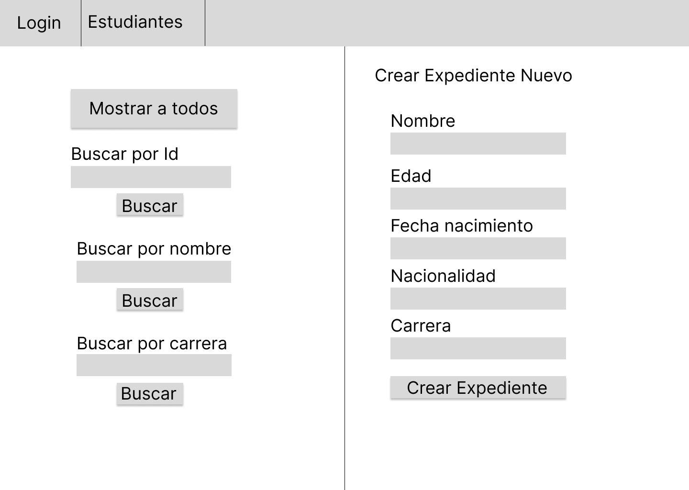

# Expediente-escolar-NEAR

Creación de un expediente académico digital de un alumno en la blockchain basado en el protocolo near mediante un contrato inteligente,donde también se podrá consultar la información por nombre y por carrera. Esto permitirá llevar el control de los datos generales de los alumnos de forma permanente y de fácil acceso.

# Justificación

Para una universidad es importante llevar un expediente de todos los alumnos, tener esta información guardada en el blockchain ayudaría a que los expedientes de los alumnos se guardarán de manera más rápida, de fácil acceso y de manera más permanente.

El expediente debe contener la información de de la institución que lo emite, junto con la fecha de ingreso y la información general del estudiante, como su nombre, teléfono, fecha de nacimiento, su código o número de cuenta entres otros datos.

También incluirá los resultados de la carga académica, anexo de documentos personales y registro de pagos.

## Contenido

Este repositorio contiene un contrato inteligente con los siguientes métodos:

### Escritura:

* `setEstudiante`
* `deleteEstudiante`

### Lectura:

* `getEstudiantes`
* `getEstudiante`
* `getEstudiantesByName`
* `getEstudianteByCareer`

El contrato se encuentra previamente desplegado en la cuenta `frankbizopps.testnet`.

Las llamadas se realizaran de la siguiente manera:

Lectura:

```sh
near view frankbizopps.testnet getEstudiantes
```

Escritura:

```sh
near call frankbizopps.testnet deleteEstudiante '{"id":"1"}'
```

## Descripción general

| Metodo                                            | Descripcion                                                   |  |
| ------------------------------------------------- | ------------------------------------------------------------- | - |
| [`/setEstudiante`](#setEstudiante)                 | Guarda la información de un estudiante en la blockchain.     |  |
| [`/getEstudiantes`](#getEstudiantes)               | Muestra la lista de estudiantes almacenados en la blockchain. |  |
| [`/getEstudiante`](#getEstudiante)                 | Muestra un estudiante por id o número de cuenta.             |  |
| [`/getEstudiantesByName`](#getEstudiantesByName)   | Muestra un listado de estudiantes filtrado por nombre.        |  |
| [`/getEstudianteByCareer`](#getEstudianteByCareer) | Muestra un listado de estudiantes filtrado por carrera.       |  |
| [`//deleteEstudiante`](#deleteEstudiante)          | Elimina un estudiante del listado guardado en la blockchain.  |  |

---

## Requisitos

- [Cuenta NEAR](https://docs.near.org/docs/develop/basics/create-account)
- [Node.js](https://nodejs.org/en/download/package-manager/)
- [npm](https://www.npmjs.com/get-npm) o [Yarn](https://yarnpkg.com/getting-started/install)
- NEAR CLI
- Cuenta Near
- Cuenta Near testnet

## Configuración inicial

1. Clonar repositorio

```bash
git clone https://github.com/nathalyzatarain/Expediente-escolar-NEAR.git
```

2. Instalar dependencias

```bash
npm install
```

## Ejecutar contrato inteligente

1. Iniciar sesión en near cli

```bash
near login
```

2. Generar build

```bash
npm run build
```

3. Deployear contrato

```bash
near dev-deploy build/debug/contrato.wasm
```

## Instrucciones de uso de los metodos

## `/setEstudiante`

> _Guarda la información de un estudiante en la blockchain_

| Parametros          | Descripcion                                    |
| ------------------- | ---------------------------------------------- |
| `nombre`          | _Nombre del alumno_                          |
| `fechaNacimiento` | _Fecha de nacimiento del alumno_             |
| `contract`        | _Account id del contrato que estas llamando_ |
| `edad`            | _Edad del alumno_                            |
| `email`           | _Cuenta de correo electronico del alumno_    |
| `telefono`        | _Numero de telefono del alumno_              |
| `nacionalidad`    | _País de nacimiento del alumno_             |
| `carrera`         | _Carrera a la que ingresa el alumno            |
| _                   |                                                |

Ejemplo de registro:

```json
{
  "nombre": "Maria Estrada",
  "fechaNacimiento": "2 de junio de 1997",
  "edad": 24,
  "email": "maria@gmail.com",
  "telefono": "6691017155",
  "nacionalidad": "mexico",
  "carrera": "psicologia"
}

```

## `/getEstudiantes`

> _Muestra todos los estudiantes que han sido registrados._
> _Sin parametros._

## `/getEstudiante`

> _Muestra un estudiante por id o número de cuenta._

| Parametros | Descripción               |
| ---------- | -------------------------- |
| `id`     | _Número de id a buscar_ |

## `/getEstudianteByName`

> _Muestra un listado de estudiantes filtrado por nombre._

| Parametros | Descripción                   |
| ---------- | ------------------------------ |
| `nombre` | _Nombre del alumno a buscar_ |

## `/getEstudianteByCareer`

> _Muestra un listado de estudiantes filtrado por carrera._

| Parametros  | Descripción                                              |
| ----------- | --------------------------------------------------------- |
| `carrera` | _Carrera por la que se quiera buscar a los estudiantes_ |

## `/deleteEstudiante`

> _Elimina un estudiante del listado guardado en la blockchain._

| Parametros | Descripción                |
| ---------- | --------------------------- |
| `id`     | _Id del alumno a elimnar_ |

## Pruebas unitarias

1- en el archivo index.unit.spec.ts es  importar todo el contenido de la carpeta assembly

```
import * ascontratofrom"../assembly";
```

2- por cada método que queramos probar creamos una función ***describe*** y le ponemos los parámetros que queramos revisar

3- en la carpeta del archivo ejecutar el comando:

* npm run test


## Mockups




